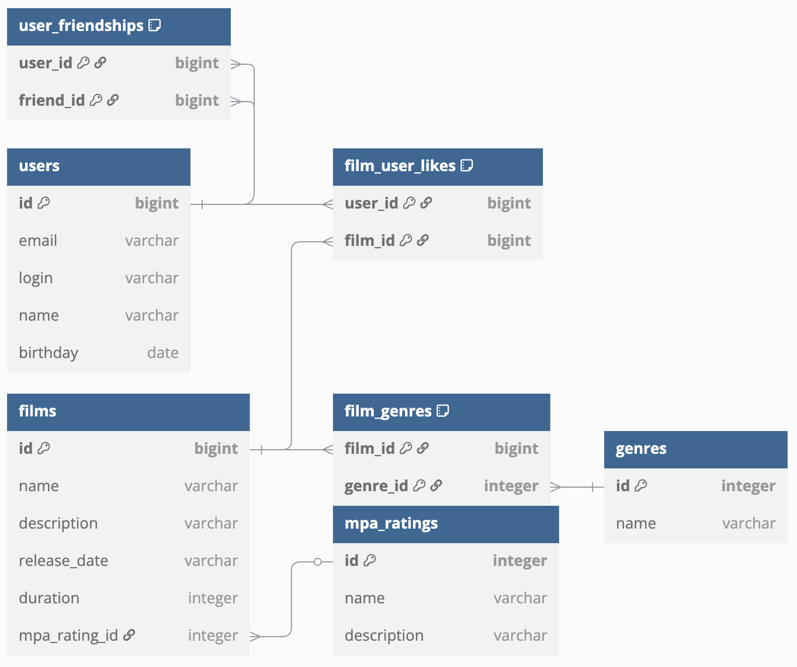

# java-filmorate
Сервис хранящий фильмы и оценки пользователей с возможность получения топ фильмов и добавления в друзья

#### Схема базы данных


##### Примеры запросов для основных операций
1. Пользователи
* POST /users - создание пользователя
    ###### body example
    ```json
    {
      "login": "dolore",
      "name": "Nick Name",
      "email": "mail@mail.ru",
      "birthday": "1946-08-20"
    }
    ```
* PUT /users - редактирование пользователя
    ###### body example
    ```json
    {
      "id": 9999,
      "login": "doloreUpdate",
      "name": "est adipisicing",
      "email": "mail@yandex.ru",
      "birthday": "1976-09-20"
    }
    ```
* GET /users - получение списка всех пользователей
* GET /users/{id} - получение информации о пользователе по id
* PUT /users/{userId}/friends/{friendId} — добавление в друзья
* DELETE /users/{userId}/friends/{friendId} — удаление из друзей
* GET /users/{userId}/friends — список друзей пользователя
* GET /users/{userId}/friends/common/{otherUserId} — список общих с другим пользователем друзья
2. Фильмы
* POST /films - создание фильма
    ###### body example
    ```json
    {
      "name": "nisi eiusmod",
      "description": "adipisicing",
      "releaseDate": "1967-03-25",
      "duration": 100
    }
    ```
* PUT /films - редактирование фильма
    ###### body example
    ```json
    {
      "id": 1,
      "name": "Film Updated",
      "releaseDate": "1989-04-17",
      "description": "New film update decription",
      "duration": 190,
      "mpaRatingId": 3
    }
    ```
* GET /films - получение списка всех фильмов
* PUT /films/{filmId}/like/{user-id} — пользователь ставит лайк фильму
* DELETE /films/{film-id}/like/{user-id} — пользователь удаляет лайк
* GET /films/popular — возвращает список из 10 самых популярных лайков 